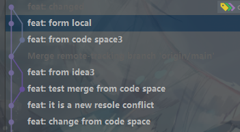
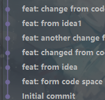
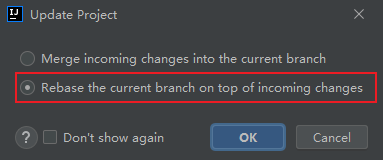
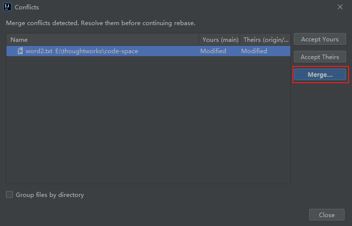
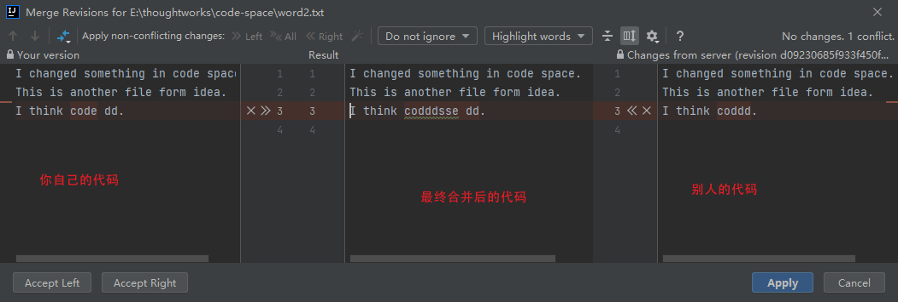
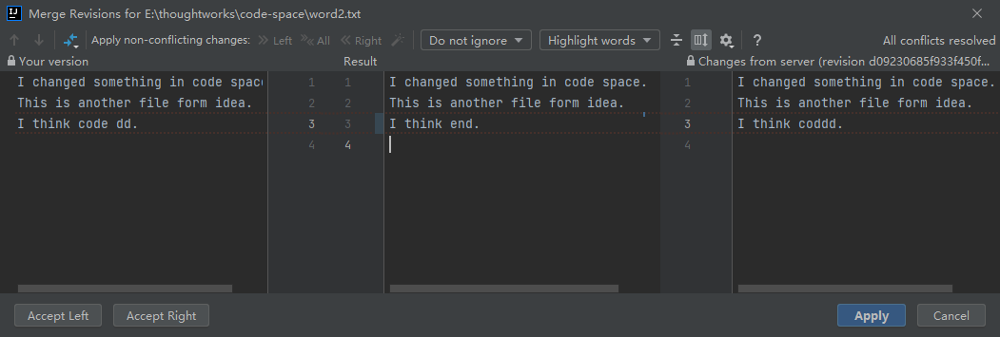

rebase命令是git中非常常见的一个命令，只要我们需要多人或者多设备协作，如果我们我们想让我们的分支看起来更加更见干净，那么就离不开rebase这个命令，下面介绍了如何在命令行和IDEA中使用rebase命令

<!--more-->

## 1.为什么需要rebase

在进行多人协作开发时，虽然通常情况下，都是每个人负责一个功能。这样每个人都负责自己的代码块，不会去修改其他人的代码，那么代码就不会冲突。

但是实际上，总会出现多个人编写或修改同一行代码的情形。

对于文件A，两个员工同时从远端拉取代码，这样两个人的代码都是最新的，这时员工一在文件A第三行添加了一行代码，然后`commit`并`push`到了远程代码仓库；员工二也在文件A第三行添加了一行代码，并`commit`。

这时如果员工二执行推送也就是`push`命令，是会被远程仓库拒绝的，因为它不知道应该采用哪个人的版本，这时候就需要执行`pull`命令，先更新代码库，这时就会在本地新建一个临时分支，同时冲突的代码块也会用类似于下面的格式标明

```txt
<<<<<<< HEAD
I think 1 better. //自己在本地编写commit但是没有push的代码
=======
I think code is better. // 其他人已经commit并且push的代码
>>>>>>> 2449b6fb8fba4c703514b3da0174aca8c53e4177
```

这时候我们就需要修改这个部分，将其改写成我们需要的东西，比如改写成下面的形式

```txt
I think code space is better.
```

然后执行

```bash
$ git add .
$ git commit -m "feat: changed"
$ git merge main # 将修改后的代码合并回主分支
$ git push
```

这样我们就把最终的结果推送到了远程代码仓库。

但是这样我们的提交历史记录就会非常ugly，比如像下面这个样子



对于这种情况，我们其实没有必要新建临时分支。遇到这种情况时，如果我们想要一个比较干净的提交历史，比如下面这样子



就可以使用`rebase`命令。

## 2. 使用rebase

### a 命令行用法

1. 在执行`push`命令之前，首先执行

   ```bash
   $ git pull --rebase
   ```

2. 这时本地就会显示冲突代码

   ```txt
   <<<<<<< HEAD
   I think 1 better. //自己在本地编写commit但是没有push的代码
   =======
   I think code is better. // 其他人已经commit并且push的代码
   >>>>>>> 2449b6fb8fba4c703514b3da0174aca8c53e4177
   ```

   修改成自己需要的样子，如

   ```txt
   I think code space is better.
   ```

3. 然后执行

   ```bash
   $ git add .
   $ git rebase --continue
   ```

   这时会进入一个vim操作界面，提醒你修改commit的相关信息，按`i`进入编辑模式，修改完毕后按`Esc`退出，然后输入`:wq`保存并退出编辑。(如果你只是保留了其中一个版本，而不是对两者进行整合，那么不会弹出vim操作界面)

4. 这时就已经修改完冲突的代码了，然后执行

   ```bash
   $ git push
   ```

   将本地代码提交到远程仓库

如果想要放弃这次的rebase，那么只需要在第三步之前执行

```bash
$ git rebase --abort
```

命令即可放弃本次rebase。

### b 在IDEA中使用

原理是一样的，只是IDEA的图形化界面可以让我们的操作更直观

1. 点击update project

   

   

2. 在弹出的窗口中选择rebase

   

3. 点击OK后，在弹出的窗口中选择Merge

   

   注意这里有三个选项，其实很容易理解，Accept Yours就是保留自己的，Accept Theirs就是保留对方的，Merge就是我们需要自己决定冲突的部分最后是什么样子

4. 之后会弹出窗口提示修改

   

5. 修改后的样子，点击Apply即可保存修改

   

   注意不能有标红的部分，因为标红的部分代表冲突，而我们之所以这样做就是为了解决冲突

6. 然后推送

   ```bash
   $ git push
   ```

这样一个简单的使用IDEA进行rebase的过程就完成了

## 3. 总结

1. rebase可以帮助我们整洁我们的提交历史，防止添加无意义的临时分支。
2. `merge`命令更适用于开发新功能，比如给计算器添加求和功能，这时候我们就可以新建一个分支，开发完后再合并到主分支。或者新建dev等分支，等dev分支一个阶段完毕后，合并到主分支
