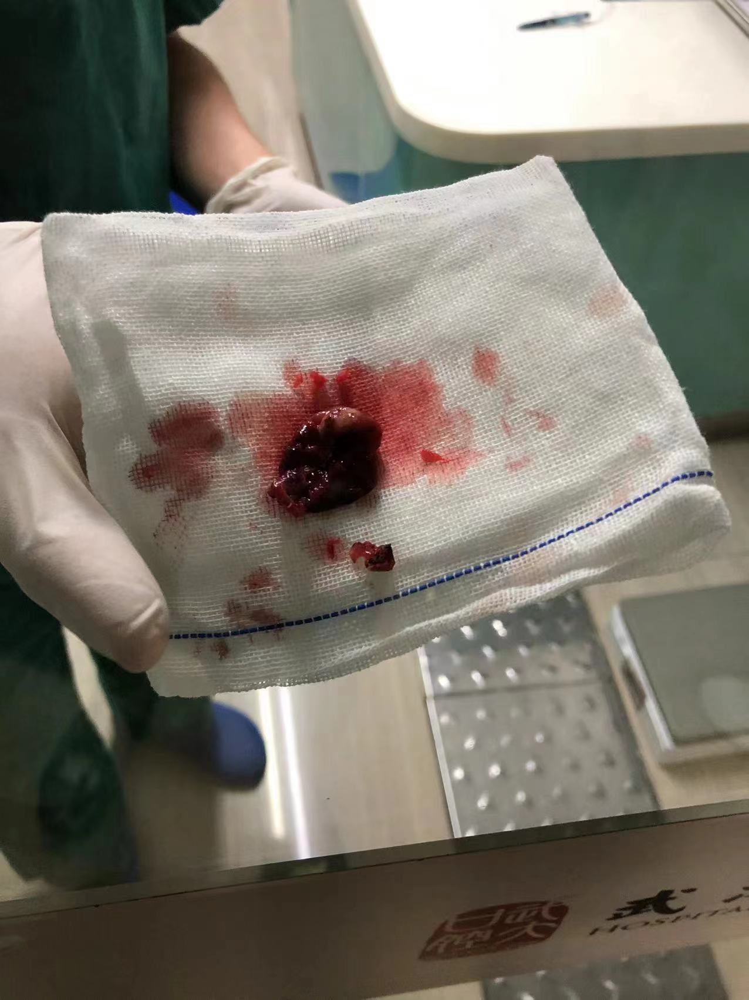

本文主要介绍一下本人上颌骨囊肿的治疗历程，后面如果有人有相同病症的话，也可以以此为依据，根据自己的状况，及时去医院检查。

<!--more-->

## 1. 前言

对于上颌骨囊肿这个名词，可能很多人都没有听说过，但是其实这种病还是比较常见的。顾名思义，上颌骨囊肿其实就是长在上颌骨位置的一个囊肿，这种病大多数时候并不严重，而且囊肿一般也都是良性的。

有的人囊肿比较小，如果不做检查的话，可能都不会发现在颌骨部位长了一个囊肿，这种情况下不需要做什么处理；对于稍大一点的囊肿，其实在门诊做一些引流，往往也能很快解决，恢复起来也很快。然而很不幸的是，我的囊肿比较大，必须要通过手术才能摘除。

## 2. 起因

今年六月份正好毕业，收拾完东西，租好房子后，其实就等着入职了。虽说要处理一些毕业的事情，但实际上也没有多少事，跟着流程来，也都顺利完成了。然而，就在走完入职手续后，我发现我的鼻子左侧的脸颊似乎有点肿，用手摸一摸的话，是能感觉到有个肿块在里面的，我心里顿时凉了半截，心想这是什么情况，早不出现晚不出现，偏偏在我入职后出现这种情况。

当时脑中出现的第一个想法就是要不先别管了，等到培训结束后再说，毕竟只是看起来有点肿，摸起来也不痛，似乎也没什么太大影响。然而自从我发现这个现象后，就总是忍不住摸脸上肿胀的地方，最后还是忍不住去了小区门口的牙科诊所看了下。然后我一次听到了颌骨囊肿这个词。

当时诊所的的医生判断囊肿大概是3x2cm，已经算是一个比较大的囊肿了，拍完片子后也发现确实如此。像这么大的囊肿，诊所自然是无法摘除的（当时天真的我以为也许在诊所引流下，把这个包里面的液体引流出来就好了），况且由于诊所没法做病理检测，实际上他们也没法确定这是一个良性的囊肿还是其他更严重的东西。于是就推荐我直接去武大口腔那边挂号看一下，挂的是头颈肿瘤科室的号。

当时我大脑瞬间一片空白，毕竟我上次去这种大医院，还是小学手臂骨折的时候，况且那时候也只是打了个石膏。这时候突然要我一个人去医院，挂号看病的流程我也不清楚，尤其是这种病听起来似乎还很严重，入职的喜悦也被冲的一干二净，只剩下忧虑。

## 3. 初诊

医院看病的流程其实也挺清晰，基本就是下面几个步骤：

1. 网上挂号；
2. 用身份证（如果没带身份证就需要填个单子），办就诊卡，充值；
3. 到对应的科室前台处签到，后面就等叫号就可以了。

看病的过程也算是一波三折，由于当天临时挂号，排的位置很靠后，轮到我的时候，已经很晚了。专家看完后，觉得可能就是一个普通的囊肿，但是还需要片子确认，然而科室的电脑没有联网，而且诊所拍的片子生成的电子文件也没法在手机上预览，于是只好在医院又拍了一次片子。由于第一次去医院，对各个窗口也不是很熟悉，所以缴费没有那么及时，轮到我拍片的时候，离下班也就半个小时左右，这里提醒去医院看病的小伙伴，一定要及时缴费。

不过还好，虽然片子还没有打印出来，但是电脑上已经能看到了，最后诊断是上颌骨囊肿。而且比较麻烦的是，由于囊肿已经比较大了，所以只能住院做手术摘除，如果拖的太晚，那涉及到到的五颗牙齿可能都保不住了，除此之外，还有一些其他的问题，不过囊肿的问题是最严重的。然而想到我马上就要参加公司的培训了，所以只能往后推迟一个月。毕竟刚入职就请假，而且还错过公司的培训，那绝对是能够让自己凉透的操作。

## 4. 住院前夕

幸好，将近一个月的培训中，并没有出现什么特别的情况，培训也算是圆满结束，只是囊肿似乎越来越大了，感觉有点压迫眼睛（也可能是我的心理作用），幸好培训过程中比较投入，虽然总是忍不住想囊肿的事情，但是由于把自己每天的计划都安排的满满当当的，所以也没有多少闲工夫来思考这些杂事，只是偶尔空闲的时候，心情总是会有些沉重，然而还总是要保持一种积极向上的状态，毕竟培训期间还是要好好表现的，这种割裂感往往才是最让人无力的吧。

虽然不想请假，但是该请还是要请，毕竟八月份就必须要把手术做了，如果拖到国庆，虽然不用请假了，但是可能那几颗牙也就和我说再见了。

然而请假也没有那么顺利。

本来以为八月初就能做手术，然而医院那边却一直没床位，问什么时候有床位，一直不确定。我这住院证都开了一个月了，那我至少相当于提前一个月排队了吧，结果还要等。等也就罢了，连个确定的日期都不给，这让我怎么请假？毕竟这还是一周的长假。本来请这么长的假就已经很不合适了，如果临时请的话，那就更不合适了，况且培训结束后，公司也要安排项目了，你这还有这么长的一个假不确定什么时候请。当时真是压力山大，生怕什么事情做不好。

最后终于确定了在八月中旬做手术，也赶紧请了假，由于是全麻，需要有家人陪同。然而我家里人都在千里之外，然而这还不是最让人头疼的，如果是外省的人，还需要三天两检，也就是说到达本省后，必须第三天的核酸阴性结果出来后，才能进医院，那时候我才能做手术，如果能安排上的话。

我头一次感受到了来自疫情的恶意，在此之前，各种核酸检测，层层加码，虽然不是很喜欢，但是也没有怎么抵触，毕竟大家都一样，况且我也不怎么喜欢出去。然而周三开始的假，周一我才知道还有这种政策，毕竟之前我以为的三天两检是落地捡，加上24小时后的核酸检测是阴性就可以了。

于是马上联系家里人，正好我姐夫在，于是连夜坐飞机赶了过来。之所以这么急是因为医院周末不做手术，如果而且做完手术后也需要恢复，如果真是因为家属没有陪同，导致延期到下一周做手术，那么上一周的假相当于白请。

## 5. 住院

就这样，周三上午到了医院办入院手续，结果上午没有床位，只好推迟到了下午，期间也把各种手术前的检查做了一遍，因为来之前通知如果顺利的话，第二天就能安排手术。结果自然是没有那么顺利，不过最终还是安排到了周五手术，这样有一个周末作为缓冲，也能多恢复一下。

虽然住院之前的经历并不愉快，但是住院后的体验还是很不错的，医院的医生都挺细心的。尤其是术前需要做根管，这样可以最大程度上保证术后也不会脱落。由于我五颗牙都需要做根管，当时通知的时候，已经快中午了，一个下午肯定做不完，但是当医生知道我第二天早上要做手术的时候，硬是从下午两点做到了晚上快九点，中间也没休息，顺利做完五颗牙。这里还是要点一个赞。

不过做根管的过程也是有些痛苦，毕竟时间很长，想想近七个小时，大部分时间躺在椅子上，时不时还要拍片判断填充物是不是到了正确的位置，再有就是嘴要一直张着。那种经历我这辈子都不想体验第二次。

相比而言，手术倒还算顺利，毕竟全麻也没什么感觉，手术两个小时就结束了。

下面是摘除的囊肿的照片。

高能预警！！！！！！

----------------------------------------------------华丽的分割线------------------------------

------------------------分割线---------------------

由于是全麻，做完手术后脑袋昏昏沉沉的，直到快到晚上了，才真正清醒过来。手术部位用冰袋冷敷，主要是为了消肿。

不知道是镇痛泵还是其他缘故，虽然我左侧几乎所有牙齿牙龈部位都有缝线，但我却感觉不到疼痛。但是我后面在网上搜索了一下，镇痛泵其实作用也没有那么大。那应该就是医生手术做的比较好吧，所以不怎么痛。

看到我做完手术后状态还行，我家里人就回去了，毕竟还要工作的。

后面几天就是挂吊瓶，一些消炎之类的药，脸也没一开始那么肿了。

于是到了下周一，上午挂完吊瓶后，就出院了，刚好下午上班。这样算起来，实际上就三天半的假，也算是一切顺利，然而由于社保系统升级，导致社保卡没法办，于是只能先自费垫付。结果这刚上班，还没怎么赚钱，就要家里先贴钱了，这也没谁了，没钱，真是连病都生不起。

整个住院过程就算是结束了。

后续就是等待切口的愈合以及颌骨重新长好了。

住院期间的话，对于短期住院，也不需要准备太多的东西，只要下面这些其实基本就够了：

1. 拖鞋
2. 纸巾
3. 一套换洗衣物（可无），一套开胸睡衣
4. 脸盆
5. 洗漱用品
6. 毛巾

如果是长期住院，比如一周以上，那就需要多准备点东西了。

此外关于住院、挂号、手术、复查的医生，其实我也挺迷的，因为负责住院的医生、看病的专家、手术的医生、复查的医生，都可以不是一个人......

只是说看病和做手术的医生是同科室，不知道大医院都这样子还是其他原因导致的。

## 6. 复查

### 1. 伤口发炎

虽然出院的时候脸还是有点肿，但是医生说慢慢消肿，所以也就没在意。然而一周后，手术部位出现了一个硬块，而且脸更肿了。由于科室周末没有号，只能周一到周五挂号，顿时让我陷入了两难的抉择。毕竟这才刚请完假不久，总不能又请假去复查吧，于是只好挂了上午最早的号，结果医生查房很晚才过来，导致差点上班迟到，不过也确实是发炎了，需要打几天消炎针。当然也是第一次这么晚到公司，鉴于之前实习期员工的传言，又一次感受到了生活的恶意。

不过还好，打完消炎针后，硬块消失了，只是脸依旧有些肿，可能是一些积液需要时间慢慢吸收吧，

### 2. 术后一月复查

兜兜转转，做完手术也一个多月了，虽然切口都愈合了，一些缝线也渐渐吸收了。但是牙龈部位一直有些肿胀，按一下就瘪下去了，只好先去小诊所看了下（挂号太难了），可能问题不大，也可能是和原来囊肿所在的位置形成了通道，那就比较麻烦了，只好等下周去医院复查了，希望一切顺利吧。

未完待更。。。

-------------------------

## 7. 后记

在口腔的囊肿里面，上颌骨囊肿算是比较好的一种情况了，因为术后的复发率低一些，而下颌骨囊肿，术后的复发率就要高很多。

此外之前还没怎么注意，上班了后才发现，很多面向社会的机构，都是周一到周五上班，或者很多业务都是周一到周五才能办，这就和正常的上班时间一样，所以要办什么业务只能请假去办，也不知道类似的这些机构，什么时候可以调整一些时间，比如工作日的某天调整到周末，这样也不用非得请假才能去办理业务了，只是现在看来，似乎任重而道远。
